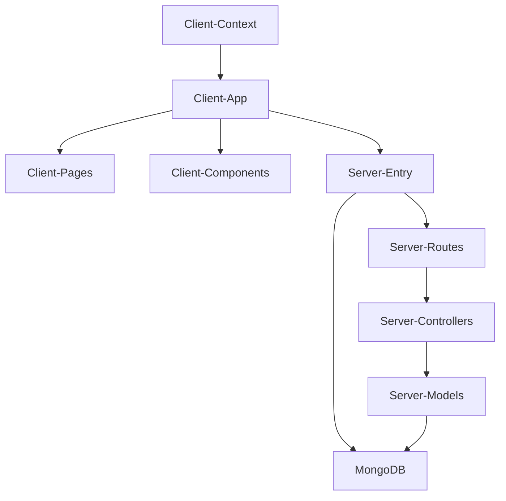

# ShoeVista — Architecture

## 1. Stack
- Frontend: React 18 + Vite 5, React Router v6, Tailwind CSS, axios, react-toastify, react-slick, react-stars (Testing/client/package.json)
- Backend: Node.js + Express 4, Mongoose 8 (Testing/server/package.json)
- Database: MongoDB, connected via Mongoose in Testing/server/index.js
- Dev tooling: nodemon (server start script), ESLint (client lint script)

## 2. Directory map
| path | what lives there |
|---|---|
| README.md | root project description (MERN stack e-commerce app) |
| Testing/client | React + Vite frontend app |
| Testing/client/src | app entry, pages, components, context, assets |
| Testing/server | Node.js/Express REST API |
| Testing/server/routes | Express route definitions (productRoutes.js) |
| Testing/server/controllers | request handlers (productControllers.js) |
| Testing/server/models | Mongoose schemas (productModel.js) |

## 3. Diagram

## 4. Component index
- [[Client-App]]
- [[Client-Pages]]
- [[Client-Components]]
- [[Client-Context]]
- [[Server-Entry]]
- [[Server-Routes]]
- [[Server-Controllers]]
- [[Server-Models]]
- [[MongoDB]]

## 5. Entry points
- Client dev: `npm run start` in Testing/client (script "start": "vite"; Testing/client/package.json) → app entry Testing/client/src/main.jsx
- Client prod build: `npm run build` in Testing/client (script "build": "vite build")
- Client prod preview: `npm run preview` in Testing/client (script "preview": "vite preview")
- Server dev/start: `npm run start` in Testing/server (script "start": "nodemon index.js"; Testing/server/package.json) → entry Testing/server/index.js
- TODO: verify — no separate production start script observed for the server beyond the nodemon-based "start"

## 6. Conventions
(Observed only, from files actually read)
- Server uses ES modules: `"type": "module"` in Testing/server/package.json with `import` syntax in Testing/server/index.js
- Server resource files are suffixed by role and grouped in matching folders: routes/productRoutes.js, controllers/productControllers.js, models/productModel.js
- Server startup uses async functions with try/catch, `console.error` on failure, and `process.exit(1)` on DB/startup errors (Testing/server/index.js)
- Server mounts all API routes under a single `/api` prefix: `app.use("/api", router)` (Testing/server/index.js)
- Client env/config loaded via `dotenv.config()` at the top of the server entry file (Testing/server/index.js)
- Client root files (main.jsx, App.jsx) sit at src/ root; feature code is split into src/pages, src/components, src/context, src/assets
- Client functional components use the `const Name = () => {...}; export default Name` pattern (Testing/client/src/App.jsx)
- Client global state is provided via Context providers wrapping the router in main.jsx (WishListProvider, CartProvider — Testing/client/src/main.jsx)
- Client routing is centralized in one file using `createBrowserRouter` (Testing/client/src/main.jsx), with page-level route elements and a shared `App` layout using `<Outlet />`

## 7. Where things go
- New product API endpoint: add route in Testing/server/routes/productRoutes.js, handler in Testing/server/controllers/productControllers.js, schema field in Testing/server/models/productModel.js
- New frontend page: add file to Testing/client/src/pages/, then register its route in the router config in Testing/client/src/main.jsx
- New reusable UI element: add to Testing/client/src/components/, import where needed (page or Testing/client/src/App.jsx)
- New global client state: add a provider under Testing/client/src/context/, wrap it around the router in Testing/client/src/main.jsx alongside WishListProvider/CartProvider
- New server env var: read via `process.env` in Testing/server/index.js (loaded through dotenv) — TODO: verify .env location, out of scope to open
